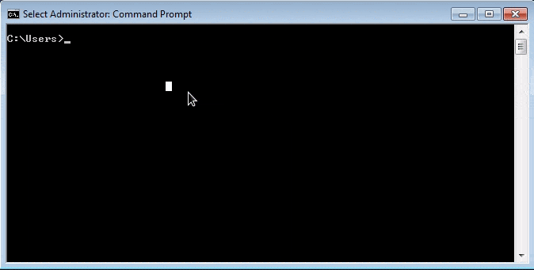

# Adventure Game Studio Chocolatey package

[](https://ci.appveyor.com/project/ericoporto/ags-choco-pkg/branch/master)



Adventure Game Studio Chocolatey package, to install you will need Chocolatey 
installed. Then right click either cmd.exe or powershell and select
**`Run as administrator`**, and on the command prompt type:

    cinst ags

To uninstall, type

    choco uninstall ags

## Install Path

AGS will be installed in the Program Files. You can find it by creating a 
variable like below.

    SET AGS_PATH=%ProgramFiles(X86)%\Adventure Game Studio 3.5.0\
    IF NOT DEFINED ProgramFiles(x86) SET AGS_PATH=%ProgramFiles%\Adventure Game Studio 3.5.0\

## Building this package

If you want to build this package yourself, in a windows environment with git 
and chocolatey installed, use the commands below

    git clone https://github.com/ericoporto/ags-choco-pkg.git
    cd ags-choco-pkg
    choco pack
    choco install ags -s .,chocolatey
	
If you are building on your PC or you want to use a specific version, you can specify a version adding `--version VERSIONNUMBER` to the command above.
    
To uninstall, on the same dir, just type

    choco uninstall ags -s .
 
## Pushing a package to chocolatey

The text below is so I can remember how to do this.
```
choco apikey --key YOURAPIKEYHERE --source https://push.chocolatey.org/
choco push ags*.nupkg --source https://push.chocolatey.org/
```